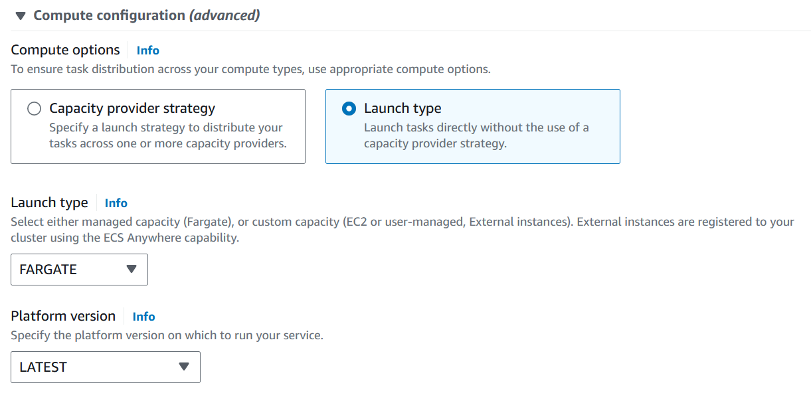
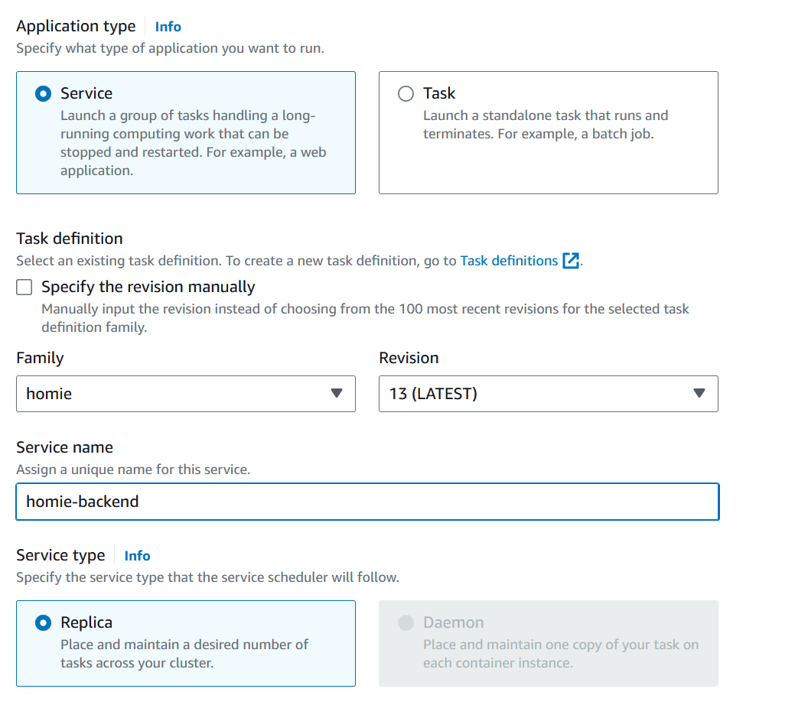

# AWS ECS Deployment Guide

This instruction is based on GitHub's guide in using Continuous Deployment (CD) to deploy Node.js apps in an AWS cluster using GitHub Actions.

Prerequisites:

- Own an AWS account
- Dockerfile for the application to deploy
- `DB_CLOUD_URI` in GitHub Action Secrets

Test the docker image locally to ensure it is running correctly.

1. Sign in to AWS and create an ECR to store the docker images.

   Using the AWS CLI, type the command

   ```bash
    aws ecr create-repository \
    --repository-name ECR_REPOSITORY \
    --region AWS_REGION
   ```

   Replace the `ECR_REPOSITORY` and `AWS_REGION` values with the values you have set up in [`cd-backend.yml`](../.github/workflows/cd-backend.yml)

   Copy paste the contents [`task-definition.sample.json`](../.aws/task-definition.sample.json) in a new file.

   Replace the `ECR_REPOSITORY` value and fill in the `AWS_ACCOUNT_ID` value.

   Set the `ECS_TASK_DEFINITION` in [`cd-backend.yml`](../.github/workflows/cd-backend.yml) to the task-definition filepath.

2. Create a new security group to ensure that the deployment is accessible through any IP.

   Ensure that it is accessible through any IP for HTTP and HTTPS and TCP port 8000.

3. Create an `ECS Cluster`.

   Search for `ECS` in the searchbar in AWS Console. When given the choice to pick the cluster type, select `AWS Fargate (Serverless)`.

   Ensure you use the same ECS Cluster name as the `ECS_CLUSTER` value in [`cd-backend.yml`](../.github/workflows/cd-backend.yml)

4. Create a `Task Definition` to deploy the application.

   When creating the Task Definition, click on the dropdown `Create new task definition with JSON` and copy paste the content of [`task-definition.json`](../.aws/task-definition.json)

5. Create an ECS Service inside the ECS Cluster.

   `Compute Configuration` setting

   

   `Deployment configuration` setting

   

   Ensure `Service name` is set to the same value as `ECS_SERVICE` in [`cd-backend.yml`](../.github/workflows/cd-backend.yml)

   In the `Networking` section. Select the security group created in step 2.

   Configure an `Application Load Balancer` to enable auto-scaling based on number of requests in `Service auto scaling`

6. Create an `Amazon IAM Access Key`.

   Store the values in GitHub Action Secrets named `AWS_ACCESS_KEY_ID` and `AWS_SECRET_ACCESS_KEY`.
